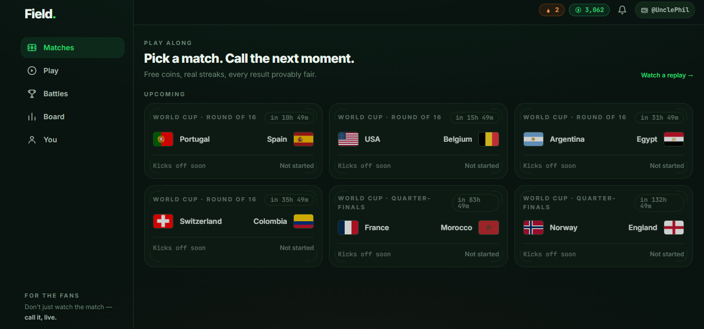
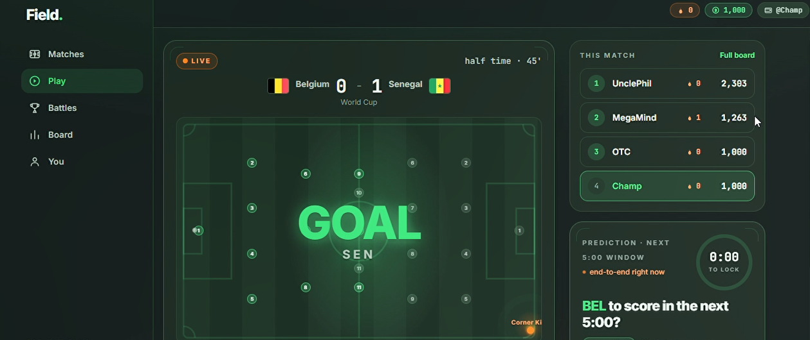
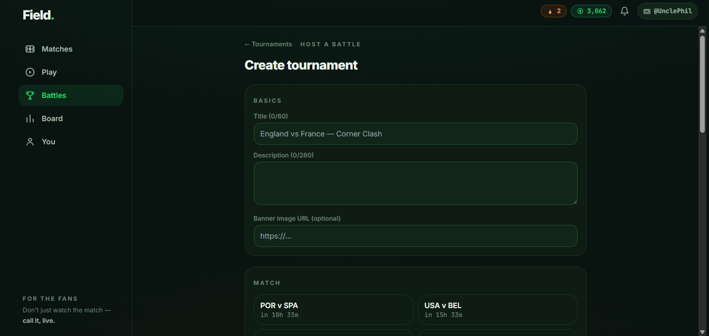
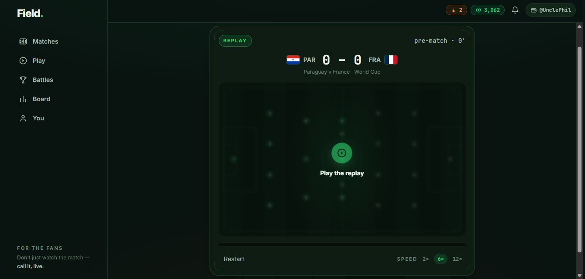

# FanField

Play the match while it happens. FanField is a live, play-along football game: you
predict the next goal, card, or corner over a short window, build a streak, and
climb the leaderboard. It is free to play and it is not a betting site — you play
with points and coins, not real-money stakes.

Every result is settled from a verifiable live data feed, so outcomes are decided
by what actually happened on the pitch, not by a house. Sponsor-funded tournaments
add real USDC prizes that hosts pay to winners directly, with each payment checked
on-chain. FanField never holds anyone's money.

Live at **fanfield.xyz**

---

## Contents

- [Brief technical documentation](#brief-technical-documentation)
- [What you can do](#what-you-can-do)
- [How a prediction works](#how-a-prediction-works)
- [Tournaments (Prediction Battles)](#tournaments-prediction-battles)
- [Notifications](#notifications)
- [What we use from TxODDS](#what-we-use-from-txodds)
- [Tech stack](#tech-stack)
- [Architecture](#architecture)
- [Running it locally](#running-it-locally)
- [Environment and secrets](#environment-and-secrets)
- [Security](#security)
- [Screenshots](#screenshots)
- [Project layout](#project-layout)

---

## Brief technical documentation

### Core idea

Football is most fun when you have something riding on the next moment. FanField
turns any live match into a fast, social game: players make short yes/no calls on
the next goal, card, or corner, and every call is settled from a verifiable live
data feed rather than by a house. Because the same feed decides every outcome, the
result is identical for everyone and can be checked. On top of that sits a light
social and rewards layer — streaks, squads, chat, and sponsor-funded tournaments —
that keeps players coming back before, during, and after the whistle.

### Business highlights

- Free to play and not a betting product — players use points and coins, which
  lowers the legal and trust barrier and widens the audience.
- Built for one of the largest live audiences on earth (the World Cup), where the
  gap between goals is exactly the attention FanField captures.
- Tournaments create real stakes without FanField ever touching money: hosts fund
  USDC prizes and pay winners directly, and each payment is verified on-chain. This
  keeps the platform out of custody and compliance-heavy money flows.
- Growth is built in: squad invites, shareable "brag" cards, and Telegram alerts
  each turn one player into several.

### Technical highlights

- Real-data only, no mocks. All game state resolves from Supabase (Postgres,
  Auth, Realtime, Edge Functions) and the TxLINE feed.
- A single scheduled Edge Function (the "engine") runs every minute and is the
  authority for the whole game: it syncs fixtures, advances live matches from the
  feed clock and status, opens and settles prediction cards, updates coins and
  streaks, finalizes tournament standings, and fans out notifications.
- Verifiable settlement: cards resolve against the feed's stat values, and each
  settled call keeps a receipt referencing the TxODDS oracle anchored on Solana.
- Odds-aware pricing: when market odds are available, a card's payout multiplier is
  derived from the implied win probability, so harder calls pay more.
- The browser never holds a secret or talks to the feed. Row Level Security scopes
  user data; all privileged writes run server-side with the service role.
- Notifications fan out to three channels from one call — in-app inbox (Realtime),
  browser push (FCM), and Telegram — each gated by user preference.

### TxLINE endpoints used

Access uses a short-lived guest JWT plus an API token, sent on every data request
as a bearer token and an `X-Api-Token` header. All feed calls are server-side only.

| Purpose | Method + endpoint |
|---|---|
| Start a guest session (JWT) | `POST /auth/guest/start` |
| Activate the API token | `POST /api/token/activate` |
| World Cup fixtures | `GET /api/fixtures/snapshot` |
| Current score/state for a fixture | `GET /api/scores/snapshot/{fixtureId}` |
| Live score/stat updates | `GET /api/scores/updates/{fixtureId}` |
| Historical scores (replays, backfill) | `GET /api/scores/historical/{fixtureId}` |
| Market odds for a fixture | `GET /api/odds/snapshot/{fixtureId}` |
| Stat validation / proof for a receipt | `GET /api/scores/stat-validation?fixtureId={id}&seq={seq}&statKey={key}` |

Fixtures give us the match list. Scores snapshots and updates drive the live clock,
phase (from the status id), score, cards, and corners, and settle prediction cards.
Odds set the payout multiplier. Stat validation backs the provably-fair receipt.

## What you can do

- Play along with live matches and call the next goal, card, or corner.
- Build a streak. A longer streak raises your score multiplier.
- Earn coins and climb a global leaderboard.
- Join tournaments with a free points stack and compete for host-funded USDC prizes.
- Rewatch any finished match in Replay mode, with an animated timeline of events.
- Get alerts in the app, as browser push, and on Telegram.
- Sign in with a username and password or with a Solana wallet, and link the other later.

## How a prediction works

During a live match, FanField opens a prediction card with a simple yes or no
question and a short window, for example "Corner for England in the next 5 minutes".
You place a call and stake some coins. When the window closes, the engine reads the
live feed and settles the card:

- If the feed confirms the event, "yes" wins and "no" loses.
- If the feed cannot confirm the event in time, the card is voided, your stake is
  returned, and your streak is kept.

Because settlement uses a verifiable feed and not a person, the result is the same
for everyone and can be checked. Winning odds are weighted using the live match odds
when they are available, so harder calls pay more.

## Tournaments (Prediction Battles)

A tournament is a contest built on a single match.

- Entry is free. Every player starts with the same points stack (1,000 points).
- The host funds a USDC prize pool and sets how it splits across the top finishers.
- Players earn and lose points on the tournament's own prediction cards during the match.
- When the match ends, final standings are locked from the live feed.
- The host pays winners directly from their own wallet. FanField verifies each payment
  on-chain and marks the payout as paid once the transaction checks out.

FanField never takes custody of prize money. It only records standings and confirms
that the on-chain payment matches the amount owed.

## Notifications

FanField sends the same events across three channels, and each is optional:

- In-app inbox, updated live.
- Browser push notifications.
- Telegram, through the FanField bot.

Events include pre-match reminders, kick-off and full-time, goals, cards, corners,
new prediction cards to play, and tournament results. Match-event alerts go only to
people who are playing or following that match, and every alert respects the user's
notification settings. To turn on Telegram, a user opens You, taps Connect Telegram,
and starts the bot with a one-time code.

## What we use from TxODDS

Live match data comes from the TxODDS TxLINE feed. FanField uses it as the single
source of truth for both the live experience and settlement:

- Fixtures. The World Cup schedule is synced into the app's match list.
- Live scores and match state. The feed's status id sets the match phase (pre-match,
  first half, half-time, second half, full-time), and the feed clock gives the real
  match minute. Placeholder entries without a status id are ignored so a finished
  match is never shown as live.
- Live statistics. Goals, cards, and corners are read from the feed's per-period stat
  values and turned into pitch events and prediction settlement.
- Odds. When market odds are available, the implied win probability is used to price
  a prediction card's multiplier, so calls are weighted by how likely they are.
- Verifiable settlement. Prediction cards are resolved against the feed, and each
  settled call keeps a receipt that references the TxODDS oracle anchored on Solana.

Access uses a guest token plus an API token, handled entirely on the server. No feed
credentials are ever exposed to the browser.

## Tech stack

- Frontend: React 18, Vite, TypeScript, Tailwind CSS.
- Backend: Supabase — Postgres, Auth, Realtime, and Edge Functions (Deno).
- Data: TxODDS TxLINE feed.
- Chain: Solana, read through an RPC endpoint for payout verification and receipts.
- Wallet sign-in: Reown AppKit (WalletConnect and injected wallets).
- Notifications: Supabase Realtime (inbox), Firebase Cloud Messaging (push), Telegram Bot API.

## Architecture

The browser app never talks to the database or the data feed directly. All game
logic and every secret live on the server.

```
                        +---------------------------+
                        |  Browser app (React/Vite) |
                        |  play, chat, tournaments  |
                        +---------------------------+
                          |  reads (Realtime, RLS)  ^  writes (session)
                          v                         |
       +--------------------------------------------------------------+
       |                    Supabase                                  |
       |   Postgres + RLS      Realtime        Auth                   |
       |                                                              |
       |   Edge Functions (Deno, service role)                       |
       |   engine-tick (every minute) . tournaments . squads .       |
       |   match-predict . chat . telegram(+webhook) . auth          |
       +--------------------------------------------------------------+
             |                      |                       |
             v                      v                       v
     +----------------+   +------------------+   +----------------------+
     | TxLINE / TxODDS|   |  Solana RPC      |   |  FCM + Telegram      |
     | fixtures,      |   |  verify USDC     |   |  push + bot alerts   |
     | scores, odds,  |   |  payouts, oracle |   |                      |
     | stat proofs    |   |  receipts        |   |                      |
     +----------------+   +------------------+   +----------------------+
```


- A scheduled Edge Function (the engine) runs every minute. It syncs fixtures,
  advances live matches from the feed, opens and settles prediction cards, updates
  coins and streaks, finalizes tournament standings, and sends notifications.
- Edge Functions handle sign-in, tournaments, payouts, and the Telegram link and
  webhook. They authenticate the caller from their session and use the service role
  only on the server.
- Row Level Security is on for user data, so people can read and change only their
  own rows. Public tables such as matches and tournaments are read-only to everyone.
- Shared work lives in `supabase/functions/_shared` (feed client, scoring, odds,
  notifications, and so on).

Shared link previews are rendered on the host as serverless functions, so a shared
match, tournament, or replay link unfurls as a branded card on social apps.

## Running it locally

You need Node 18 or newer and a Supabase project.

```bash
cd frontend
cp .env.example .env    # fill in the values below
npm install
npm run dev
```

The app runs on http://localhost:5173.

Backend migrations and Edge Functions are deployed with the Supabase CLI:

```bash
cd supabase
supabase db push
supabase functions deploy
```

See `supabase/README.md` for the full backend setup, including the scheduled engine
and the Telegram webhook.

## Environment and secrets

The frontend reads a small set of public values from `.env`:

- `VITE_SUPABASE_URL` and `VITE_SUPABASE_PUBLISHABLE_KEY`
- `VITE_SOLANA_CLUSTER`
- Reown and Firebase public keys used by the browser SDKs

All private values are Supabase Edge Function secrets and never appear in the repo or
in the browser. These include the service role key, the TxODDS feed tokens, the cron
secret, the Firebase service account, and the Telegram bot token and webhook secret.
Secret files and `.env` files are git-ignored.

## Security

- No private keys in the client. The browser only ever holds public keys. The service
  role key, feed tokens, and bot token are server-only secrets.
- Row Level Security on all user tables. Users can read and write only their own data.
  Writes that affect balances or standings run on the server with the service role.
- Protected server actions. The engine and tournament settlement require a shared cron
  secret. Marking a payout as paid is limited to the tournament host and is verified
  on-chain before it is accepted.
- Verified Telegram webhook. The webhook only accepts requests that carry the correct
  secret token, and one Telegram chat maps to exactly one account.
- No fund custody. Hosts pay winners directly. FanField only reads the chain to confirm
  a payment happened.
- Safe link previews. Shared-link cards are built from a fixed canonical origin, so a
  spoofed request header cannot poison a cached preview.

## Screenshots

Add captures from fanfield.xyz to `docs/screenshots/` and they will show here.









## Project layout

```
field/
  frontend/    React app (UI, routing, client data access)
  supabase/    Postgres migrations and Edge Functions (the backend)
  backend/     One-off chain and feed scripts, plus reference docs
  docs/        Feed and API reference, screenshots
```

---

Built for the World Cup. Come play at **fanfield.xyz**.
